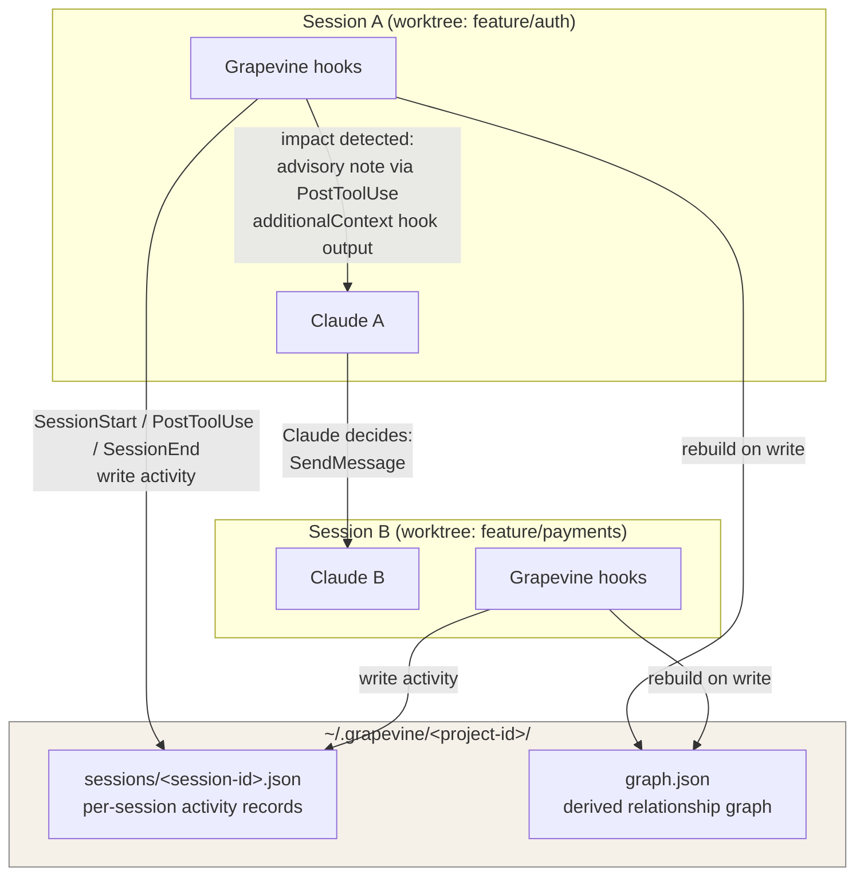

# Grapevine 🍇

**Coordination awareness for independent Claude Code sessions you steer yourself.**

Claude Code's [cross-session messaging](https://code.claude.com/docs/en/cross-session-messaging) lets your sessions talk, and [agent teams](https://code.claude.com/docs/en/agent-teams) coordinate sessions Claude spawns — but independent sessions you start yourself are mutually blind. `ListAgents` returns names and directories, not intent or dependencies, so nobody notices when the auth session edits a module the payments session is building on. Grapevine fills that gap: it observes each session through hooks, builds a graph of which sessions touch and depend on which files, and — when your edit lands on something a peer cares about — drops an advisory note into *your own* session so your Claude can decide whether a heads-up message to the peer is warranted.

## Architecture



*One deliberate deviation from the original design sketch: the note reaches Claude A through the PostToolUse hook's `additionalContext` output rather than the inbox socket — see [Design principles](#design-principles).*

## Install

Requirements: **Claude Code ≥ v2.1.224**, **macOS or Linux**, `python3` (3.10+) and `git` on PATH. No pip dependencies.

### From the plugin marketplace (recommended)

This repo doubles as its own [plugin marketplace](https://code.claude.com/docs/en/plugin-marketplaces). Inside any Claude Code session:

```
/plugin marketplace add DannyMac180/grapevine
/plugin install grapevine@grapevine
```

That installs Grapevine for every future session — no clone, no flags. Update later with `/plugin marketplace update grapevine`, or remove with `/plugin uninstall grapevine`.

### From a local clone

```bash
git clone https://github.com/DannyMac180/grapevine.git
claude --plugin-dir ./grapevine
```

The `--plugin-dir` flag loads it for that single session only. To load it in every session without the flag, install through the marketplace above, or keep it in your skills directory (`~/.claude/skills/grapevine/`).

### Verify

Either way, verify with `/plugin` (Grapevine listed, no errors) or by editing any file and running `/gv-status` — your session's record should appear.

Grapevine must be installed in **every session you want observed** — an unobserved session is invisible to the graph.

## How it works

1. Your session's `PostToolUse` hook fires after an Edit/Write. It records the touched file in the session's activity record (`~/.grapevine/<project-id>/sessions/`) and rebuilds `graph.json`.
2. The hook checks the graph: does any *other live session* have an edge to this file — touched it directly, or touched a file one import-hop away from it?
3. If yes (and the pair wasn't already notified in the last 10 minutes), the hook emits an advisory note into **your own session's context**: *"Grapevine: you just modified `src/auth/middleware.ts`. Peer session "payments-3f" (feature/payments, their file src/payments/webhook.ts imports it) may be affected…"*
4. Your Claude reads the note alongside the tool result, judges relevance, and — only if warranted — uses `SendMessage` to notify `payments-3f`.
5. The peer session receives it under its normal inbound-approval rules and adapts.

Sessions are matched per project: all worktrees of one repo hash to the same `project-id` (via `git rev-parse --git-common-dir`), so parallel-worktree workflows are covered.

## Commands

- `/grapevine:gv-status` — this session's record, live peers, and the last 5 notes sent.
- `/grapevine:gv-graph` — the current graph as an ASCII adjacency list plus a paste-anywhere Mermaid block.

## Design principles

- **Grapevine never sends cross-session messages itself.** It only surfaces advisory context in the editing session; the decision to `SendMessage` belongs to that session's Claude (and ultimately you). No inbound-approval controls are ever bypassed.
- **Notes are advisory only.** They never instruct Claude to change settings, approve anything, or act automatically — "consider sending them a brief message; otherwise ignore."
- **Fail-open hooks.** Every hook traps all exceptions, logs to `~/.grapevine/log`, and exits 0. A broken courier never breaks a coding session. The PostToolUse path also self-limits to a 500ms budget — if the graph rebuild would exceed it, the file touch is still recorded and the rebuild waits for the next edit.
- **No data leaves the machine.** State lives in `~/.grapevine/`, readable only by your OS user; nothing is sent anywhere.
- **Why hook output instead of the inbox socket:** the docs sanction a hook posting to its own session's inbox socket (own-child messages auto-deliver), but publish no wire format for writing to it, and macOS own-child verification only works while the posting process is alive. Rather than guess at undocumented bytes, v1 delivers the note synchronously as PostToolUse [`additionalContext`](https://code.claude.com/docs/en/hooks) hook output — same effect, fully documented path. If Anthropic publishes a socket write format, `notify.py` has the seam for it.

## Configuration

| Env var | Default | Effect |
|---|---|---|
| `GV_DISABLE=1` | unset | Every hook becomes a no-op (no state writes, instant exit) |
| `GV_DEBOUNCE_MINUTES` | `10` | Suppression window for repeat notes about the same (file, peer) pair |
| `GV_MAX_FILES` | `200` | Most-recent files kept per session record (min 1) |
| `GV_NEIGHBORHOOD_CAP` | `400` | Max files import-parsed per graph rebuild (truncation is logged) |

Set them in your shell or a settings `env` map before starting the session.

## Limitations

- **Same machine only.** Peer discovery uses local state files; there is no cross-machine coordination.
- **Plain text only**, matching the messaging channel itself.
- **One-hop imports.** The graph resolves direct import edges only (no transitive closure), regex-based, for **TypeScript/JavaScript, Python, and Go**. Other languages still get direct shared-file detection.
- **Sessions must run the plugin** to be visible; records go stale after 24h without activity and are pruned.
- **Import edges are resolved against the editing session's checkout.** Peer files are parsed at their repo-relative path under the editor's worktree, so heavily divergent branches can yield stale or missing edges. Advisory-only by design.
- **Import resolution is approximate.** Regex parsing plus best-effort path resolution (Go imports are module paths tail-matched against repo directories; Python package resolution is anchored at the repo root) — expect false negatives on unusual layouts. Missed edges mean a missed nudge, never a wrong action.
- **Crashed sessions can linger briefly.** `SessionEnd` doesn't fire on a crash or terminal kill, and hook process trees make pid capture best-effort, so liveness uses pid + a 30-minute heartbeat grace window. A crashed session may appear as a peer for up to ~30 minutes. (The per-turn `Stop` event is deliberately *not* used to mark sessions ended — it fires at every turn end and would flag live sessions dead between turns.)

## Uninstall

- Loaded via `--plugin-dir`: just drop the flag next launch. Skills-directory install: remove `~/.claude/skills/grapevine/`. Marketplace install: `/plugin` → Grapevine → uninstall.
- Wipe all observed state: `rm -rf ~/.grapevine` — it holds only Grapevine's own records (session activity, graph, notes, log) and is safely regenerated from scratch.

## Go deeper

I write [**Attention Heads**](https://attentionheads.substack.com/?utm_source=github&utm_medium=readme&utm_campaign=grapevine) — deep, evidence-backed writing on AI, cognition, and agentic engineering. The **Agentic Engineering Field Notes** series is where I publish practical advice on the craft of using AI. [Subscribe](https://attentionheads.substack.com/subscribe?utm_source=github&utm_medium=readme&utm_campaign=grapevine) to get new posts to your inbox.

## Development

```bash
python3 -m unittest discover -s tests   # 42 tests, stdlib only
```

MIT licensed. See [docs/spec.md](docs/spec.md) for the original build spec.
