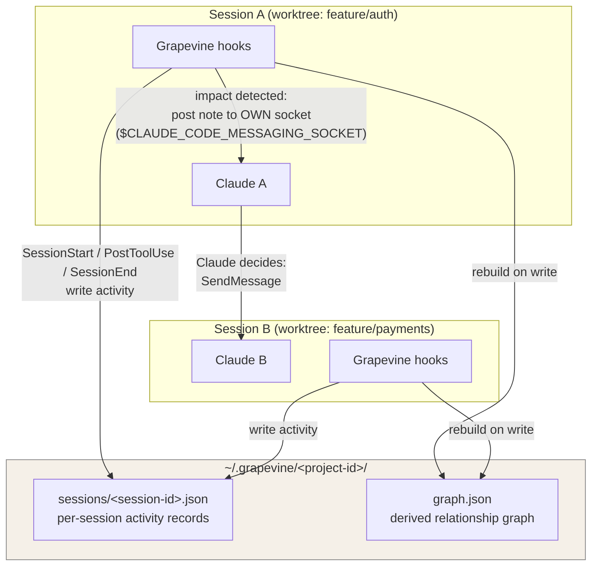

# Grapevine 🍇 — Build Instructions

> Instructions for Claude Code: build this project start to finish. Work through the phases in order. Verify each phase's acceptance criteria before moving on. Before starting, fetch https://code.claude.com/docs/en/cross-session-messaging, https://code.claude.com/docs/en/hooks, and https://code.claude.com/docs/en/plugins to confirm current APIs — do not rely on memory for hook event names, plugin manifest schema, or messaging behavior.

## 0. Naming

The project's official display name is **Grapevine 🍇** — include the grape emoji in the README title, plugin display name, and any user-facing branding. Use the plain slug `grapevine` (no emoji) for the repo name, directories, file paths, package identifiers, and code.

## 1. What we're building

**Grapevine** is a Claude Code plugin that gives independent sessions in the same project a shared awareness of each other. Claude Code's cross-session messaging feature lets sessions send messages, but each session is blind to what the others are *doing* — `ListAgents` returns names and directories, not intent or dependencies.

Grapevine fixes this by:

1. **Observing** each session via hooks (what task it's on, what files it touches, which branch/worktree it's in).
2. **Building a graph** of session relationships from that observed state (shared files, shared modules, import-level dependencies).
3. **Nudging** a session — via its own inbox socket — when another session's activity affects something it depends on, so its Claude can decide whether to send a cross-session message.

Key design principle: **Grapevine never sends cross-session messages itself.** It injects context into a session's *own* inbox (own-child messages are auto-delivered per the docs), and that session's Claude decides whether the situation warrants a `SendMessage` to a peer. This keeps humans and Claude in the loop and avoids fighting inbound-approval controls.

Scope constraints (from the platform):

- Same-machine only (peer discovery uses local registry files; sockets are per-machine).
- macOS + Linux, Claude Code ≥ v2.1.224.
- Plain-text messages only.

## 2. Architecture



**Flow, end to end:**

1. Session A's `PostToolUse` hook fires after an Edit/Write. It records the touched file in A's activity record and rebuilds `graph.json`.
2. The hook checks the graph: does any *other live session* have an edge to this file (touched it, or depends on a module that imports it)?
3. If yes, the hook posts a plain-text note to **Session A's own inbox socket**: *"Heads up: you just modified `src/auth/middleware.ts`. Session `payments-3f` (worktree feature/payments) has touched files that import it. Consider messaging them if this change is breaking."*
4. Claude A reads the note between tool calls, judges relevance, and — only if warranted — uses `SendMessage` to notify `payments-3f`.
5. Claude B receives it under normal inbound rules and adapts.

## 3. Repository layout

```
grapevine/
├── .claude-plugin/
│   └── plugin.json              # plugin manifest (confirm schema against docs)
├── hooks/
│   └── hooks.json               # hook registrations
├── scripts/
│   ├── gv-session-start.sh      # register session, capture task context
│   ├── gv-post-tool.sh          # record file touches, rebuild graph, detect impact
│   ├── gv-session-end.sh        # deregister / mark session ended
│   └── lib/
│       ├── state.py             # read/write activity records (atomic, file-locked)
│       ├── graph.py             # graph construction + impact queries
│       ├── notify.py            # post plain text to $CLAUDE_CODE_MESSAGING_SOCKET
│       └── prune.py             # drop dead sessions from state
├── commands/
│   ├── gv-graph.md              # /gv-graph — render current session graph
│   └── gv-status.md             # /gv-status — this session's record + live peers
├── tests/
│   ├── test_state.py
│   ├── test_graph.py
│   └── test_impact.py
├── README.md
└── LICENSE (MIT)
```

Implementation language: **Python 3.10+ stdlib only** for `lib/` (no pip deps — hooks must run instantly and anywhere). Shell scripts are thin wrappers that call the Python entry points.

## 4. Component specifications

### 4.1 Shared state (`lib/state.py`)

- Root: `~/.grapevine/<project-id>/` where `project-id` = hash of the git repo's common dir (`git rev-parse --git-common-dir`, resolved to absolute path) so all worktrees of one repo share a state dir. Fall back to hash of `$PWD` outside git.
- Per-session record `sessions/<session-id>.json`:

```json
{
  "session_id": "…",
  "name": "payments-3f",
  "pid": 12345,
  "socket": "uds:/path/to/inbox.sock",
  "cwd": "/repo/worktrees/payments",
  "branch": "feature/payments",
  "started_at": "2026-08-08T14:02:11Z",
  "last_seen": "2026-08-08T14:31:40Z",
  "task_hint": "implementing Stripe webhook handling",
  "files_touched": {"src/payments/webhook.ts": "2026-08-08T14:30:02Z"},
  "ended": false
}
```

- All writes atomic (write temp file + `os.replace`) with an advisory lock (`fcntl.flock`) on a dir-level lockfile.
- `files_touched` capped at the 200 most recent paths per session; paths stored repo-relative.
- Liveness: a session is live if `ended == false`, its `pid` exists, and `last_seen` < 24h old. `prune.py` removes records failing this; run it opportunistically on every SessionStart.

### 4.2 Hooks

Register in `hooks/hooks.json` (confirm exact event names and payload fields against the hooks docs):

- **SessionStart** → `gv-session-start.sh`
  - Create/refresh this session's record: session id, name, pid, cwd, branch (`git branch --show-current`), and `$CLAUDE_CODE_MESSAGING_SOCKET`.
  - Run prune.
  - Optionally read the first user prompt later (see UserPromptSubmit below) to populate `task_hint`.
- **UserPromptSubmit** → lightweight: update `last_seen`; if `task_hint` is empty, store a truncated (≤140 char) copy of the first prompt as the hint.
- **PostToolUse** (matcher: Edit, Write, MultiEdit, NotebookEdit) → `gv-post-tool.sh`
  - Extract the edited file path from the hook payload.
  - Append to `files_touched`, update `last_seen`, rebuild graph, run impact check (4.4).
  - Hard time budget: exit within 500ms; if graph rebuild would exceed it, write the touch and skip rebuild (next hook catches up).
- **SessionEnd / Stop** → `gv-session-end.sh` — set `ended: true`.

All hooks must be fail-open: any exception → log to `~/.grapevine/log` and exit 0. A broken courier must never break a coding session.

### 4.3 Graph (`lib/graph.py`)

Nodes: live sessions + files. Edges:

1. **touched**: session → file (from activity records).
2. **imports**: file → file. Build lazily and cache: for files touched by ≥2 live sessions' *neighborhoods*, parse import statements (regex-based, support ts/js/py/go initially) one level deep. Cache in `graph.json` keyed by file mtime; never parse the whole repo.
3. **shares-worktree-base**: session ↔ session when on branches of the same repo (always true within a project-id; used only for message phrasing).

Impact query `who_cares(file, editing_session) -> [(session, reason)]`:

- Any other live session that touched `file` directly → reason "touched this file".
- Any other live session that touched a file which imports `file` (or which `file` imports, one hop) → reason "depends on / is depended on by".
- Dedupe, exclude the editing session, exclude sessions notified about the *same (file, peer)* pair within the last 10 minutes (store a small `notified.json` debounce map).

### 4.4 Notifier (`lib/notify.py`)

- Connect to `$CLAUDE_CODE_MESSAGING_SOCKET` (strip the `uds:` prefix) as a Unix domain socket from the hook process — this is an own-child post, which the receiving session auto-delivers when no `crossSessionInbound` override applies.
- Confirm the wire format for posting to the socket against current docs before implementing; if the docs don't specify a public write format, fall back to Plan B: instead of the socket, emit the note as hook **stdout/JSON output** so it lands in Claude's context via the hook result (check the hooks doc for the supported "additionalContext"-style field on PostToolUse).
- Note template (plain text, ≤3 sentences):

```
Grapevine: you just modified {file}. Peer session "{name}" ({branch}, {reason}) may be affected. If this change could break or unblock them, consider sending them a brief message; otherwise ignore.
```

- Never instruct Claude to change settings or auto-approve anything; the note is advisory only.

### 4.5 Commands

- `/gv-status` — print this session's record, live peers, and the last 5 notes sent.
- `/gv-graph` — render the current graph as an ASCII adjacency list plus a Mermaid block the user can paste anywhere.

## 5. Build phases & acceptance criteria

**Phase 1 — State layer.** Implement `state.py` + `prune.py` + tests. ✅ Two simulated sessions write concurrently without corruption; prune removes dead-pid records.

**Phase 2 — Hooks wiring.** plugin.json + hooks.json + shell wrappers. ✅ Installing the plugin and starting a session creates a record with correct socket path; editing a file updates `files_touched`; `time` shows PostToolUse wrapper < 500ms on a warm run.

**Phase 3 — Graph + impact.** `graph.py` + tests with fixture repos (two worktrees, one shared module). ✅ `who_cares` returns the peer for (a) direct shared file and (b) one-hop import; debounce suppresses repeat within 10 min.

**Phase 4 — Notifier.** `notify.py` with socket path + hook-output fallback. ✅ Manual test: two real sessions in two worktrees; editing a shared module in A produces a courier note in A, and Claude A (when the change is breaking) sends a message B receives.

**Phase 5 — Commands, README, polish.** ✅ `/gv-status` and `/gv-graph` work; README complete (section 6); fresh-clone install instructions verified.

## 6. README requirements

The README must include:

1. One-paragraph pitch: what gap this fills relative to built-in messaging and agent teams ("coordination awareness for independent sessions you steer yourself").
2. The Mermaid architecture diagram from section 2 (adapted to final implementation).
3. Install: plugin installation steps per current Claude Code plugin docs, plus requirements (v2.1.224+, macOS/Linux).
4. How it works: the 5-step flow from section 2.
5. Design principles: courier never sends cross-session messages itself; fail-open hooks; advisory-only notes; no data leaves the machine.
6. Configuration: env vars `GV_DISABLE=1`, `GV_DEBOUNCE_MINUTES`, `GV_MAX_FILES`.
7. Limitations: same-machine, plain text, one-hop imports, supported languages.
8. Uninstall + how to wipe `~/.grapevine`.

## 7. Non-goals (v1)

- No cross-machine coordination.
- No daemon/background process — hooks only.
- No automatic SendMessage on Claude's behalf via scripting.
- No semantic task-similarity matching (task_hint is display-only in v1; graph edges are file-based).
